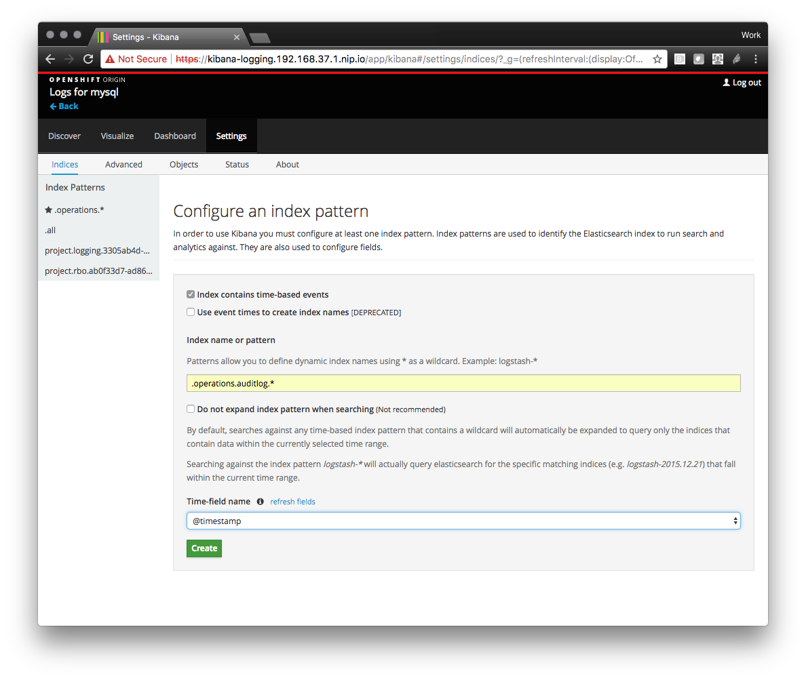
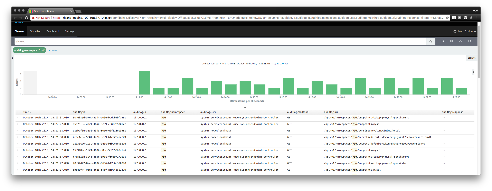
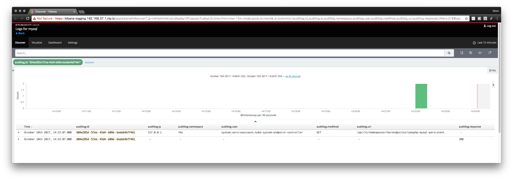
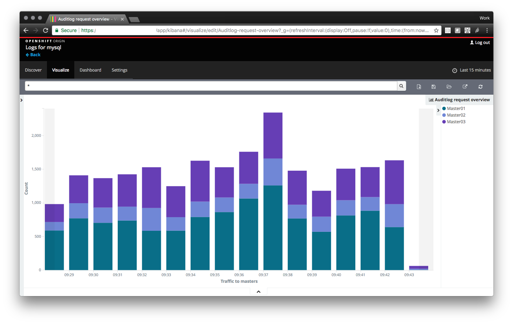

# Put auditlog into elasticsearch
A quick-n-diry example to put the openshift audit log into elasticsearch.
## Installation

-  Edit configmap logging-fluentd ```oc edit configmap/logging-fluentd```
  - Adjust ```fluent.conf```, add ```@include configs.d/user/input-auditlog.conf``` after ```@include configs.d/openshift/input-post-*.conf```
  - Add  [input-auditlog.conf](input-auditlog.conf) to configmap - don't forget to adjust the audit log filename, default: /auditlog/auditlog.log
- Adjust kibana to use the new .operations.audit.* indicies 

## Example for OpenShift on RHEL
### master-config.yml

Add to /etc/origin/master/master-config.yaml

```
auditConfig:
  auditFilePath: /var/log/audit-ocp.log
  enabled: true
```

For example:

```
$ grep -A7 ^auditConfig /etc/origin/master/master-config.yaml
auditConfig:
  auditFilePath: /var/log/audit-ocp.log
  enabled: true
  maximumFileRetentionDays: 14
  maximumFileSizeMegabytes: 500
  maximumRetainedFiles: 5
authConfig:
  requestHeader:
```


## Screenhosts
### Whats happen at namespace rbo?


### Whats happen with request 604e...


### How may requests gets every master



### Info for oc cluster up users
Start oc cluster up with (mac os)

## Know issues
- Ignores timezone in auditlog file (It is recommended to use UTC.)
    ```
    UTC timestamp : 2017-10-12T06:55:59.496790107Z
    CET timestamp : 2017-10-12T08:56:52.795808328+02:00
    ```
- Container installation is not tested
- ~~Missing hostname in document~~ - fixed
- Adjust & test curator
- Cluster update?


##### Add Local ip adress
```sudo ifconfig lo0 alias 192.168.37.1```
##### Start OpenShift
```
oc cluster up \
  --host-config-dir=${BASE_PATH}/host-config-dir/ \
  --host-data-dir=${BASE_PATH}/host-data-dir/ \
  --host-pv-dir=${BASE_PATH}/host-pv-dir/ \
  --public-hostname=192.168.37.1 \
  --logging=true
```

##### Add pv for auditlog to fluent
```
oc create -f pvc.yml -n logging
oc volume daemonset/logging-fluentd --add --mount-path=/auditlog --name=auditlog -t pvc --claim-name=auditlog
```
##### Stop cluster
```
oc cluster down
```
#####  Adjust master config, write audit log to audit pv from fluent
In my case:

```
grep audit host-config-dir/master/master-config.yaml
auditConfig:
  auditFilePath: "/Users/rbo/Development/oc-cluster/host-pv-dir/pv0044/auditlog.log"
```
##### Start OpenShift again
```
oc cluster up \
 --service-catalog=true \
 --host-config-dir=${BASE_PATH}/host-config-dir/ \
 --host-data-dir=${BASE_PATH}/host-data-dir/ \
 --host-pv-dir=${BASE_PATH}/host-pv-dir/ \
 --public-hostname=192.168.37.1 \
 --use-existing-config \
 --logging=true
```


## Better access to elasticsearch with Kopf

[https://blog.openshift.com/managing-elasticsearch-with-kopf-in-openshift-origin-3-6/](https://blog.openshift.com/managing-elasticsearch-with-kopf-in-openshift-origin-3-6/)
